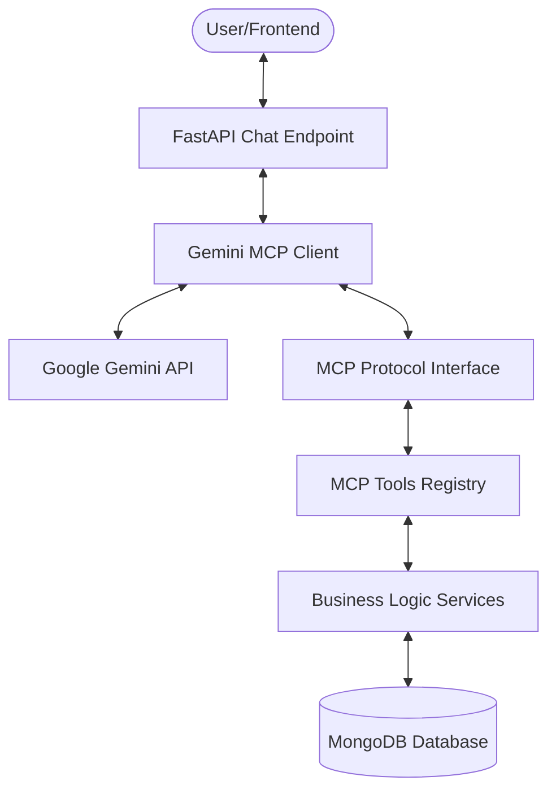

# Chat Assistant Technical Architecture

This document describes the flow of information and technical components involved in the Chat Assistant, from the user's message to the final response powered by AI and the Ratings API.

## High-Level Architecture Flow

The system follows a multi-layered architecture where a Google Gemini AI agent acts as an orchestrator, using the Model Context Protocol (MCP) to interact with the Ratings API services.

## Detailed Component Breakdown

### 1. Chat Interface (`app/api/v1/endpoints/chat.py`)
*   **Role**: Entry point for the user.
*   **Function**: Provides REST endpoints (`/api/v1/chat/` and `/api/v1/chat/stream`) for the frontend to send natural language messages. It manages conversation history and session IDs.

### 2. Gemini MCP Client (`gemini_mcp_client.py`)
*   **Role**: The AI Orchestrator.
*   **Function**: 
    *   Initializes the connection to the Google Gemini AI model.
    *   Discovers available tools by querying the MCP server.
    *   Converts MCP tool definitions into **Gemini Function Calling** format.
    *   Manages the iterative conversation loop:
        1. Sends the user prompt and tool definitions to Gemini.
        2. Receives function call requests from Gemini.
        3. Executes those calls via the MCP protocol.
        4. Sends results back to Gemini for final natural language synthesis.

### 3. MCP Protocol Interface (`app/api/v1/endpoints/mcp.py`)
*   **Role**: The Communication Bridge.
*   **Function**: Implements the Model Context Protocol over HTTP/JSON-RPC. It receives tool execution requests from the Gemini Client and routes them to the local `FastMCP` instance.

### 4. MCP Tools Registry (`app/mcp_server.py`)
*   **Role**: The Tool Definition Layer.
*   **Function**: Uses `FastMCP` to decorate and register Python functions as AI-callable tools. It provides the metadata (descriptions, schemas) that the AI needs to understand how to use each API endpoint.

### 5. Business Logic Services (`app/services/`)
*   **Role**: The Core Domain Logic.
*   **Function**: Contains the actual business logic for the Ratings API (e.g., `company_service.py`, `rating_plan_service.py`). These services handle validation, business rules, and database operations.

### 6. Data Layer (MongoDB)
*   **Role**: Persistent Storage.
*   **Function**: Stores all entity data (Companies, Products, Rating Tables, etc.) using auto-incrementing IDs and versioning.

---

## Sequence Diagram: "Get all active companies"

1.  **User**: Sends "List all active companies" to `/api/v1/chat`.
2.  **Chat API**: Instantiates `GeminiMCPClient` and calls `chat_with_gemini()`.
3.  **Gemini Client**:
    *   Calls `GET /api/v1/mcp/tools` to fetch available tools.
    *   Converts `get_companies` tool definition to Gemini format.
    *   Sends prompt + `get_companies` schema to **Google Gemini API**.
4.  **Gemini API**: Analyzes prompt and returns a `function_call` for `get_companies(active=True)`.
5.  **Gemini Client**:
    *   Receives function call.
    *   Sends JSON-RPC `tools/call` request for `get_companies` to `/api/v1/mcp/protocol`.
6.  **MCP Interface**: Routes the request to the `get_companies` function in `mcp_server.py`.
7.  **MCP Tool**: Calls `company_service.get_companies(filter_by={"active": True})`.
8.  **Service**: Queries **MongoDB** for documents where `active: true`.
9.  **MongoDB**: Returns list of company documents.
10. **Gemini Client**: Receives the raw data, formats it as a function response, and sends it back to **Gemini API**.
11. **Gemini API**: Generates a natural language summary: "I found 5 active companies: Acme Corp, Global Tech..."
12. **Chat API**: Returns the final text to the **User**.

## Technology Stack

| Layer | Technology |
|-------|------------|
| API Framework | FastAPI (Python) |
| AI Model | Google Gemini (2.0 Flash Lite) |
| Protocol | Model Context Protocol (MCP) |
| Tooling | FastMCP |
| Database | MongoDB (Motor/Asyncio) |
| Communication | HTTP / JSON-RPC / SSE |

